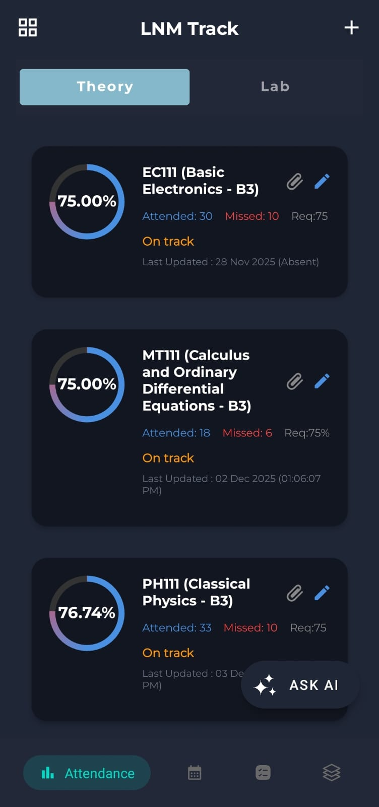
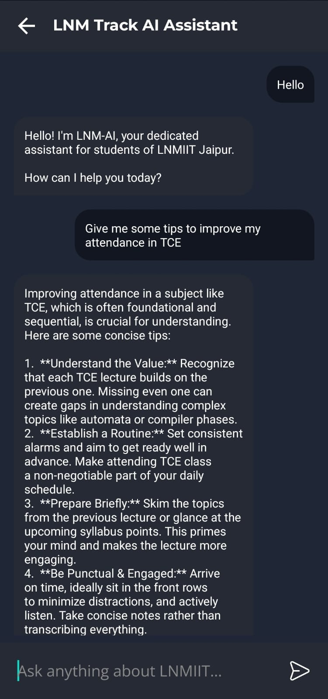
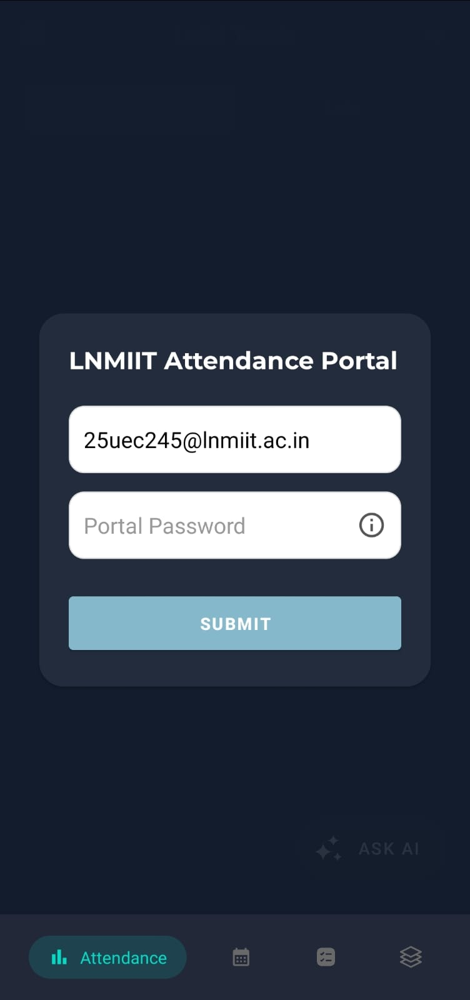

# 🚀 LNM Track

**LNM Track** is a specialized attendance management and student utility application built specifically for the **LNMIIT Jaipur** community. It combines academic tracking with AI-driven assistance to provide a seamless experience for students.

---

## 🌟 The Problem & Our Solution (Main USP)

The biggest pain point for every LNMIITian is checking attendance on the official portal. 
- **The Struggle:** You have to log in every single time, navigate through clunky menus, and scroll horizontally/vertically on a non-mobile-friendly site just to see one percentage.
- **LNM Track Solution:** Our app eliminates this friction. 
    - **One-Time Login:** Log in once and stay logged in. 
    - **Direct Dashboard:** No more scrolling! See your attendance for all subjects instantly on a clean, mobile-first dashboard.
    - **Zero Clutter:** No unnecessary menus—just the data you need, right when you need it.
---

## 🛠️ Tech Stack & Architecture

### **Frontend (Mobile App)**
* **Language:** Java (Android SDK)
* **UI/UX:** Material Design 3 with custom transitions and a dark-themed premium interface.
* **AI Engine:** Integrated with **Google Gemini 2.5 Flash** for a smart campus assistant.

### **Database & Security**
* **Database:** Firebase Realtime Database.
* **Security:** **AES-256 Bit Encryption** for portal credentials.
* **Auth:** Secure onboarding via **Firebase Google Sign-In**.

---

## 🔐 Security & Privacy (The "Digital Safe" Model)

We take student data privacy very seriously:
- **In-Memory Encryption:** Your portal password is never stored in plain text. It is encrypted using **AES-256** before being saved.
- **Safe Decryption:** Decryption only happens in the device's volatile memory (RAM) during active sessions to fetch data, ensuring your actual password is never exposed.
- **Local Control:** All sensitive processing stays on your device; we do not share credentials with any third-party servers.

---
## 📸 Screenshots

| Dashboard | AI Assistant | Security Layer |
| :---: | :---: | :---: |
|  |  |  |

---

## ✨ Key Features

* **🤖 LNM-AI Bot:** A smart assistant to help with academic queries, policies, and mess menus.
* **📊 One-Tap Dashboard:** View attendance at a glance without the portal struggle.
* **🔐 Secure Encryption:** Uses **AES-256 encryption** to store your portal credentials locally on your device, ensuring your data never leaves your hand in plain text.
* **⚡ Modern UI:** Smooth animations and a Floating Action Button for quick AI access.

---

## 👨‍💻 Developer

**Tanmay Shrivastava**
* **GitHub:** [@Tanmay1214](https://github.com/Tanmay1214)
* **College:** The LNM Institute of Information Technology, Jaipur
* **Roll Number:** 25UEC245
  
---
> **Built by a student, for the students. 🎓**
